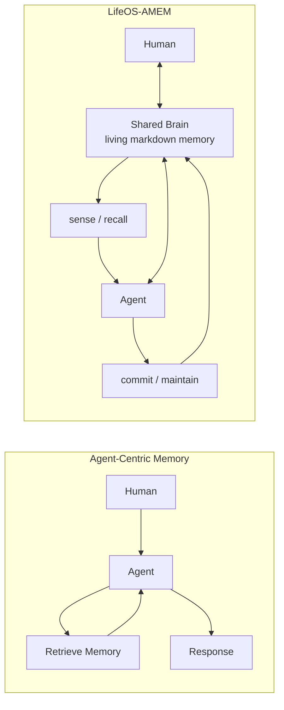

{: .img-fluid .rounded .z-depth-1}

The dream of a "Second Brain" has long been synonymous with digital hoarding—a static warehouse of notes, PDFs, and half-remembered ideas. But in the era of Large Language Models (LLMs), **the archive is dead**. A brain that only stores is not a brain; it is a graveyard. For a personal operating system to be truly "alive," it must evolve from passive storage to **active agency**. 

LifeOS 5.0 marks this transition. It is no longer a tool for Personal Knowledge Management (PKM); it is a **Blueprint for a Personal AI Operating System**. By decoupling logic (the Kernel) from storage (the Obsidian Vault), we have built a system that doesn't just remember—it perceives, associates, and executes. **Memory is not merely stored data, but the continuity of agency.**

### Mimicking the Human Loop: The Cognitive Architecture

The architectural novelty of LifeOS 5.0 does not lie in adding yet another retrieval layer. It lies in **redefining what memory is**. Conventional agent memory systems treat memory as an external resource that the agent retrieves in order to maintain response continuity. LifeOS-AMEM proposes a different model: memory as a **co-evolving shared brain** jointly inhabited by the human and the agent.

*Figure X. LifeOS-AMEM transforms memory from an agent-centric retrieval target into a co-evolving human-agent shared brain.*

*Conventional agent memory systems treat memory as an external resource retrieved by the agent to improve response continuity. In contrast, LifeOS-AMEM models memory as a shared cognitive substrate jointly inhabited by the human and the agent. Through `sense` and `recall`, the agent reads the current and historical state of this shared brain; through `commit` and `maintain`, it writes back governed updates, allowing memory to co-evolve as a digital twin rather than remain a passive retrieval store.*

### Mimicking the Human Neural: ULID as Semantic Identity

How does a stateless AI agent maintain a coherent "grip" on a sprawling filesystem? In LifeOS 5.0, the **ULID (Universally Unique Lexicographically Sortable Identifier)** acts as a **Neural Anchor**. 

By embedding these identifiers into the fabric of the Markdown body, we create a permanent link between physical text and the database's structured memory. This identity allows the agent to track a thought's evolution across years and contexts without losing its essence. In this architecture, **identity is the precursor to deep context**, enabling the system to treat every block of text as a living, evolving neuron.

### Mimicking the Human Sleep: Consolidation & Contextual Pruning

Feeding an entire knowledge base into a prompt is the equivalent of trying to think while someone reads a dictionary at you. LifeOS 5.0 solves this by mimicking the **Synaptic Pruning** that occurs during human sleep.

Utilizing the Obsidian CLI, the agent performs surgical extractions around specific ULID anchors. During "Governance Distillation" sessions—the system's equivalent of REM sleep—the agent consolidates fragmented notes and prunes away "Context Noise." By pulling only the relevant semantic neighborhood, we achieve **Cognitive Load Balancing**, ensuring the system hears only the signal, never the static.

### Conclusion: The Agentic Brain as a Functional Neuron

LifeOS 5.0 represents the end of the "Note-taking" era. We have moved beyond the storage of files into the era of **Agentic Personal Operating Systems**. 

The **Agentic Brain** is no longer a tool you use; it is a functional neuron within your own cognitive ecosystem. It responds, associates, and evolves in tandem with your intent. Your vault is no longer a static topology of files; it is an active, breathing extension of your own mind—a teammate in the ultimate pursuit of digital agency.
